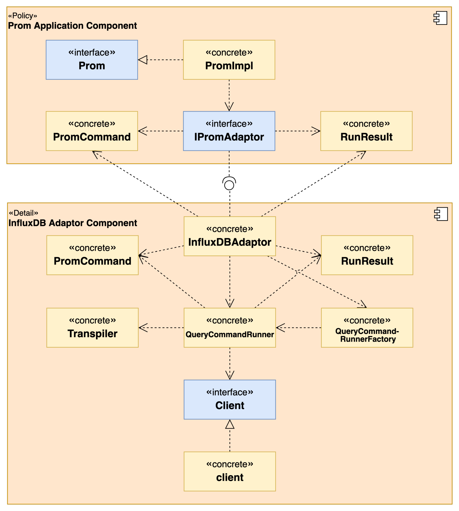
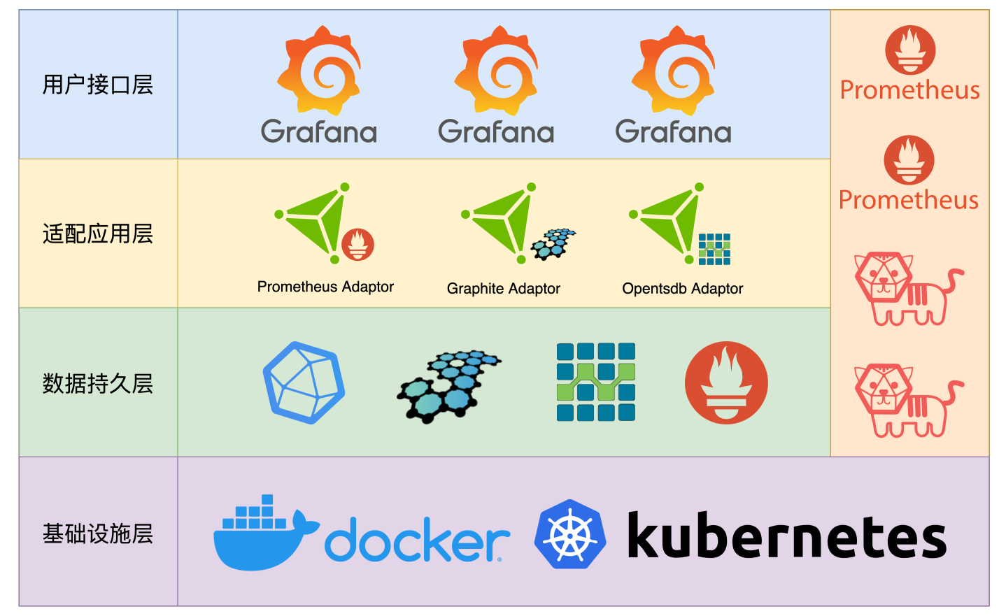

# promql2influxql

<span>
<a href="https://godoc.org/github.com/wubin1989/promql2influxql"></a>
<a href="https://github.com/wubin1989/promql2influxql/actions/workflows/go.yml"></a>
<a href="https://goreportcard.com/report/github.com/wubin1989/promql2influxql"></a>
<a href="https://github.com/wubin1989/promql2influxql"></a>
<a href="https://opensource.org/licenses/MIT"></a>
</span>
<br/>

本项目是PromQL转InfluxQL转译器和适配器，实现了传入原生PromQL查询语句，转成InfluxQL语句，并查询InfluxDB数据库返回结果。

## TOC
<!-- START doctoc generated TOC please keep comment here to allow auto update -->
<!-- DON'T EDIT THIS SECTION, INSTEAD RE-RUN doctoc TO UPDATE -->

- [前置条件](#%E5%89%8D%E7%BD%AE%E6%9D%A1%E4%BB%B6)
- [项目状态](#%E9%A1%B9%E7%9B%AE%E7%8A%B6%E6%80%81)
- [特性说明](#%E7%89%B9%E6%80%A7%E8%AF%B4%E6%98%8E)
- [截图](#%E6%88%AA%E5%9B%BE)
- [应用场景](#%E5%BA%94%E7%94%A8%E5%9C%BA%E6%99%AF)
- [UML类图](#uml%E7%B1%BB%E5%9B%BE)
- [Prometheus数据写入InfluxDB格式转换](#prometheus%E6%95%B0%E6%8D%AE%E5%86%99%E5%85%A5influxdb%E6%A0%BC%E5%BC%8F%E8%BD%AC%E6%8D%A2)
- [查询结果数据格式](#%E6%9F%A5%E8%AF%A2%E7%BB%93%E6%9E%9C%E6%95%B0%E6%8D%AE%E6%A0%BC%E5%BC%8F)
- [使用方式](#%E4%BD%BF%E7%94%A8%E6%96%B9%E5%BC%8F)
  - [第三方库](#%E7%AC%AC%E4%B8%89%E6%96%B9%E5%BA%93)
  - [RESTful服务](#restful%E6%9C%8D%E5%8A%A1)
    - [架构设计](#%E6%9E%B6%E6%9E%84%E8%AE%BE%E8%AE%A1)
    - [本地启动](#%E6%9C%AC%E5%9C%B0%E5%90%AF%E5%8A%A8)
    - [测试环境](#%E6%B5%8B%E8%AF%95%E7%8E%AF%E5%A2%83)
- [TODO](#todo)
  - [指标类型](#%E6%8C%87%E6%A0%87%E7%B1%BB%E5%9E%8B)
  - [选择器（8个）](#%E9%80%89%E6%8B%A9%E5%99%A88%E4%B8%AA)
  - [聚合操作（13个）](#%E8%81%9A%E5%90%88%E6%93%8D%E4%BD%9C13%E4%B8%AA)
  - [二元操作符（20个）](#%E4%BA%8C%E5%85%83%E6%93%8D%E4%BD%9C%E7%AC%A620%E4%B8%AA)
  - [内置函数（共70个，已支持24个）](#%E5%86%85%E7%BD%AE%E5%87%BD%E6%95%B0%E5%85%B170%E4%B8%AA%E5%B7%B2%E6%94%AF%E6%8C%8124%E4%B8%AA)
- [其他说明](#%E5%85%B6%E4%BB%96%E8%AF%B4%E6%98%8E)
  - [关于查询时间范围](#%E5%85%B3%E4%BA%8E%E6%9F%A5%E8%AF%A2%E6%97%B6%E9%97%B4%E8%8C%83%E5%9B%B4)
  - [关于图表数据查询](#%E5%85%B3%E4%BA%8E%E5%9B%BE%E8%A1%A8%E6%95%B0%E6%8D%AE%E6%9F%A5%E8%AF%A2)
  - [暂不支持PromQL多measurement查询和二元操作符两边同时为VectorSelector或MatrixSelector表达式查询](#%E6%9A%82%E4%B8%8D%E6%94%AF%E6%8C%81promql%E5%A4%9Ameasurement%E6%9F%A5%E8%AF%A2%E5%92%8C%E4%BA%8C%E5%85%83%E6%93%8D%E4%BD%9C%E7%AC%A6%E4%B8%A4%E8%BE%B9%E5%90%8C%E6%97%B6%E4%B8%BAvectorselector%E6%88%96matrixselector%E8%A1%A8%E8%BE%BE%E5%BC%8F%E6%9F%A5%E8%AF%A2)
- [Credits](#credits)
- [License](#license)

<!-- END doctoc generated TOC please keep comment here to allow auto update -->

## 前置条件
本程序基于以下前置条件开发：
- 基础设施版本：
  - Prometheus v2.41.0：Docker镜像 [prom/prometheus:v2.41.0](https://hub.docker.com/r/prom/prometheus)
  - InfluxDB v1.8.10：Docker镜像 [influxdb:1.8.10](https://hub.docker.com/_/influxdb)
- Prometheus数据写入方式：
  - [Prometheus Remote Write机制](https://prometheus.io/docs/prometheus/latest/configuration/configuration/#remote_write)
  - [InfluxDB的/api/v1/prom/write接口](https://docs.influxdata.com/influxdb/v1.8/supported_protocols/prometheus/)

## 项目状态
项目结构和核心代码基本稳定，后续开发以新增特性和性能优化为主，尽量兼容旧版本API。v1.0版本之前不建议用于生产环境。

## 特性说明
- 支持Prometheus四种指标类型：Counter、Gauge、Histogram和Summary。
- 支持PromQL的7种选择器表达式、10种聚合操作表达式、13种二元操作表达式、24种内置函数转译到InfluxQL查询语句。
- 支持作为Prometheus数据源的适配器服务接入Grafana，输入PromQL查询语句实际由适配器服务向InfluxDB实例发起查询请求和返回结果。
- 既可以作为第三方库在你的项目中依赖，也可以作为微服务单独部署。
- 面向微服务架构的代码组织结构，易扩展。

## 截图
截图中的dashboard来自[Go Metrics](https://grafana.com/grafana/dashboards/10826-go-metrics/)。有部分PromQL函数和表达式未支持，所以有个别图没有数据。后续版本都会支持到。


## 应用场景


如果你想用InfluxDB作为时序数据的底层存储，同时又希望能继续使用Prometheus的PromQL查询语句做数据分析，可以采用本项目`applications`模块下的`prom`适配服务替换掉Prometheus的接口服务，仅将Prometheus用作监控数据采集服务。

## UML类图


## Prometheus数据写入InfluxDB格式转换
```shell
# Prometheus metric
example_metric{queue="0:http://example:8086/api/v1/prom/write?db=prometheus",le="0.005"} 308

# Same metric parsed into InfluxDB
measurement
  example_metric
tags
  queue = "0:http://example:8086/api/v1/prom/write?db=prometheus"
  le = "0.005"
  job = "prometheus"
  instance = "localhost:9090"
  __name__ = "example_metric"
fields
  value = 308
```

## 查询结果数据格式
```json
{
  "resultType": "vector",
  "result": [
    {
      "metric": {
        "container": "alertmanager",
        "endpoint": "web",
        "instance": "172.17.0.4:9093",
        "job": "alertmanager-main",
        "namespace": "monitoring",
        "pod": "alertmanager-main-0",
        "service": "alertmanager-main"
      },
      "value": [
        1672995857.892,
        "8060"
      ]
    }
  ]
}
```

## 使用方式
本项目有两种使用方式：第三方库、RESTful服务等
### 第三方库
直接在你的项目根路径下执行`go get`命令即可。
```shell
go get -d github.com/wubin1989/promql2influxql@v0.0.1
```

### RESTful服务
RESTful服务代码在`promql/rpc`路径下，是一个单独的go模块。已经有了Dockerfile和docker-compose.yml文件。推荐测试环境采用docker方式部署。

#### 架构设计


#### 本地启动
```shell
go run cmd/main.go
```
可看到如下命令行日志输出：
```shell
➜  rpc git:(main) ✗ go run cmd/main.go                                 
2023/01/12 19:57:18 maxprocs: Leaving GOMAXPROCS=16: CPU quota undefined
                           _                    _
                          | |                  | |
  __ _   ___   ______   __| |  ___   _   _   __| |  ___   _   _
 / _` | / _ \ |______| / _` | / _ \ | | | | / _` | / _ \ | | | |
| (_| || (_) |        | (_| || (_) || |_| || (_| || (_) || |_| |
 \__, | \___/          \__,_| \___/  \__,_| \__,_| \___/  \__,_|
  __/ |
 |___/
2023-01-12 19:57:18 INF ================ Registered Routes ================
2023-01-12 19:57:18 INF +---------------------------+--------+----------------------------------+
2023-01-12 19:57:18 INF |           NAME            | METHOD |             PATTERN              |
2023-01-12 19:57:18 INF +---------------------------+--------+----------------------------------+
2023-01-12 19:57:18 INF | Query                     | POST   | /api/v1/query                    |
2023-01-12 19:57:18 INF | GetQuery                  | GET    | /api/v1/query                    |
2023-01-12 19:57:18 INF | Query_range               | POST   | /api/v1/query_range              |
2023-01-12 19:57:18 INF | GetQuery_range            | GET    | /api/v1/query_range              |
2023-01-12 19:57:18 INF | GetLabel_Label_nameValues | GET    | /api/v1/label/:label_name/values |
2023-01-12 19:57:18 INF | GetDoc                    | GET    | /go-doudou/doc                   |
2023-01-12 19:57:18 INF | GetOpenAPI                | GET    | /go-doudou/openapi.json          |
2023-01-12 19:57:18 INF | Prometheus                | GET    | /go-doudou/prometheus            |
2023-01-12 19:57:18 INF | GetConfig                 | GET    | /go-doudou/config                |
2023-01-12 19:57:18 INF | GetStatsvizWs             | GET    | /go-doudou/statsviz/ws           |
2023-01-12 19:57:18 INF | GetStatsviz               | GET    | /go-doudou/statsviz/*            |
2023-01-12 19:57:18 INF | GetDebugPprofCmdline      | GET    | /debug/pprof/cmdline             |
2023-01-12 19:57:18 INF | GetDebugPprofProfile      | GET    | /debug/pprof/profile             |
2023-01-12 19:57:18 INF | GetDebugPprofSymbol       | GET    | /debug/pprof/symbol              |
2023-01-12 19:57:18 INF | GetDebugPprofTrace        | GET    | /debug/pprof/trace               |
2023-01-12 19:57:18 INF | GetDebugPprofIndex        | GET    | /debug/pprof/*                   |
2023-01-12 19:57:18 INF +---------------------------+--------+----------------------------------+
2023-01-12 19:57:18 INF ===================================================
2023-01-12 19:57:18 INF Http server is listening at :9090
2023-01-12 19:57:18 INF Http server started in 6.225365ms
```

在线Swagger接口文档地址：http://localhost:9090/go-doudou/doc   
接口文档http basic用户名/密码：admin/admin

#### 测试环境
打包docker镜像
```shell
docker build -t promql2influxql_promql2influxql .
```

启动RESTful服务和基础设施容器
```shell
docker-compose -f docker-compose.yml up -d --remove-orphans
```
可以看到如下命令行日志输出
```shell
➜  rpc git:(main) ✗ docker-compose -f docker-compose.yml up -d --remove-orphans
[+] Running 6/6
 ⠿ Network rpc_default                        Created                                                                                                                                  0.1s
 ⠿ Container promql2influxql_influxdb         Started                                                                                                                                  1.1s
 ⠿ Container promql2influxql_node_exporter    Started                                                                                                                                  0.3s
 ⠿ Container promql2influxql_promql2influxql  Started                                                                                                                                  1.0s
 ⠿ Container promql2influxql_grafana          Started                                                                                                                                  1.0s
 ⠿ Container promql2influxql_prometheus       Started 
```
以下是各服务的请求地址：
- promql2influxql服务：`http://promql2influxql_promql2influxql:9090`（需要配置到grafana数据源）
- promql2influxql服务在线Swagger接口文档地址：http://localhost:9091/go-doudou/doc  
  接口文档http basic用户名/密码：admin/admin
- Grafana：`http://localhost:3000`
- Prometheus：`http://localhost:9090`（仅用作监控数据采集服务）
- Influxdb：`http://promql2influxql_influxdb:8086`

## 如何扩展
### 给适配服务扩展其他数据源适配器
如果需要新增其他数据源的PromQL转译和适配，只需在`adaptors/prom`路径下复制一套`influxdb`包的代码，修改使用即可。比如需要新增对Elasticsearch数据源的适配，只需将`influxdb`包的代码复制一套改成`elastic`（或随便什么名字）包，在里面实现转译逻辑，然后在`prom`包路径下新增一个`elasticadaptor.go`文件，把`influxdbadaptor.go`文件里的代码复制进去改改就可以了。

### 扩展其他适配服务和数据源适配器
如果需要为Grafana新增其他查询语言的适配服务，需要首先在`applications`路径下复制一套`prom`包的代码改造成一套适配服务，然后在`adaptors`路径下复制一套`prom`包的代码改造成适配器，再在适配服务里调用即可。比如需求是用Elasticsearch查询语言去查询InfluxDB里的数据，需要首先在`applications`路径下复制一套`prom`包的代码，命名为`elastic`包，然后在`adaptors`路径下复制一套`prom`包的代码，命名为`elastic`包，在`applications`模块下的`elastic`包里开发适配服务，在`adaptors`模块下的`elastic`包里开发适配器，最后在适配服务里调用适配器就可以了。

## TODO
### 指标类型
- [x] Counter：计数器
- [x] Gauge：仪表盘
- [x] Histogram：直方图
- [x] Summary：摘要
### 选择器（8个）
- [x] =：相等匹配器
- [x] !=：不相等匹配器
- [x] =~：正则表达式匹配器
- [x] !~：正则表达式相反匹配器
- [x] {}：瞬时向量选择器
- [x] {}[]：区间向量选择器  
  ~~- [ ] {}\[:\]：子查询~~（原生influxql不支持）
- [x] offset：偏移量修改器
### 聚合操作（13个）
- [x] by：相当于InfluxQL的group by语句  
  ~~- [ ] without：忽略指定标签，by的相反操作~~（原生influxql不支持）
- [x] sum：求和
- [x] min：最小值
- [x] max：最大值
- [x] avg：平均值
- [x] stddev：标准差  
  ~~- [ ] stdvar：标准差异~~（原生influxql不支持）
- [x] count：统计结果行数  
  ~~- [ ] count_values：按值分组，统计每组的结果行数~~（原生influxql不支持）
- [x] bottomk：样本值最小的k个元素
- [x] topk：样本值最大的k个元素  
- [x] quantile：分布统计
### 二元操作符（20个）
- [x] +：加法
- [x] -：减法
- [x] x：乘法
- [x] /：除法
- [x] %：取模
- [x] ^：求幂
- [x] and：且
- [x] or：或    
  ~~- [ ] unless：排除~~（原生influxql不支持）   
  ~~- [ ] ==：等于~~（原生influxql不支持）   
- [x] !=：不等于
- [x] \>：大于
- [x] <：小于
- [x] \>=：大于等于
- [x] <=：小于等于  
  ~~- [ ] bool：0表示false，1表示true~~（原生influxql不支持）  
  ~~- [ ] ignoring：忽略标签~~（原生influxql不支持）  
  ~~- [ ] on：与ignoring相反，类似by~~（原生influxql不支持）  
  ~~- [ ] group_left：多对一，类似sql的左连接~~（原生influxql不支持）  
  ~~- [ ] group_right：一对多，类似sql的右连接~~（原生influxql不支持）  
### 内置函数（共70个，已支持24个）
根据官方文档 [https://prometheus.io/docs/prometheus/latest/querying/functions/#trigonometric-functions](https://prometheus.io/docs/prometheus/latest/querying/functions/#trigonometric-functions) 整理
- [x] abs()  
  ~~- [ ] absent()~~（原生influxql不支持）
  ~~- [ ] absent_over_time()~~（原生influxql不支持）
- [x] ceil()  
  ~~- [ ] changes()~~（原生influxql不支持）    
- [ ] clamp()：按最大值、最小值区间范围筛选  
- [ ] clamp_max()：按最大值筛选  
- [ ] clamp_min()：按最小值筛选    
  ~~- [ ] day_of_month()~~（原生influxql不支持）    
  ~~- [ ] day_of_week()~~（原生influxql不支持）    
  ~~- [ ] day_of_year()~~（原生influxql不支持）    
  ~~- [ ] days_in_month()~~（原生influxql不支持）  
  ~~- [ ] delta()~~（原生influxql不支持）  
- [x] deriv()
- [x] exp()
- [x] floor()  
  ~~- [ ] histogram_count()~~（原生influxql不支持）  
  ~~- [ ] histogram_sum()~~（原生influxql不支持）  
  ~~- [ ] histogram_fraction()~~（原生influxql不支持）  
  ~~- [ ] histogram_quantile()~~（原生influxql不支持）  
- [ ] holt_winters()    
  ~~- [ ] hour()~~（原生influxql不支持）    
- [ ] idelta()
- [ ] increase()
- [ ] irate()
- [ ] label_join()
- [ ] label_replace()
- [x] ln()
- [x] log2()
- [x] log10()    
  ~~- [ ] minute()~~（原生influxql不支持）    
  ~~- [ ] month()~~（原生influxql不支持）    
- [ ] predict_linear()
- [x] rate()
- [ ] resets()
- [x] round()
- [ ] scalar()
- [ ] sgn()      
  ~~- [ ] sort()~~：InfluxDB只支持order by time，Prometheus只支持order by value      
  ~~- [ ] sort_desc()~~：InfluxDB只支持order by time，Prometheus只支持order by value    
- [x] sqrt()
- [ ] time()
- [ ] timestamp()
- [ ] vector()    
  ~~- [ ] year()~~（原生influxql不支持）    
- [x] avg_over_time()
- [x] min_over_time()
- [x] max_over_time()
- [x] sum_over_time()
- [x] count_over_time()
- [x] quantile_over_time()
- [x] stddev_over_time()    
  ~~- [ ] stdvar_over_time()~~（原生influxql不支持）  
- [ ] last_over_time()  
  ~~- [ ] present_over_time()~~（原生influxql不支持）  
- [x] acos()      
  ~~- [ ] acosh()~~（原生influxql不支持）    
- [x] asin()    
  ~~- [ ] asinh()~~（原生influxql不支持）    
- [x] atan()    
  ~~- [ ] atanh()~~（原生influxql不支持）    
- [x] cos()    
  ~~- [ ] cosh()~~（原生influxql不支持）    
- [x] sin()    
  ~~- [ ] sinh()~~（原生influxql不支持）    
- [x] tan()    
  ~~- [ ] tanh()~~（原生influxql不支持）    
  ~~- [ ] deg()~~（原生influxql不支持）    
  ~~- [ ] pi()~~（原生influxql不支持）    
  ~~- [ ] rad()~~（原生influxql不支持）   

## 其他说明

### 关于查询时间范围
- 结束时间取值优先级从最高到最低依次是：
  - `End`参数
  - PromQL查询命令中的`@`表达式
  - `Evaluation`参数
  - 当前时间
  以上的结果会跟PromQL查询命令中的`offset`表达式再计算得出最终的结束时间
- 开始时间只取`Start`参数

### 关于图表数据查询
因为原生InfluxQL不支持Prometheus的`/api/v1/query_range`接口的`step`参数和相应的计算机制，例如一段时间范围内，每隔3分钟，计算一次前10分钟的http请求增长速率，原生InfluxQL只能做到利用`group by time(3m)`语句实现一段时间范围内每隔3分钟，计算一次前3分钟的http请求增长速率，所以本项目对此的处理方式是：当PromQL查询语句中包含区间向量查询，例如`go_gc_duration_seconds_count[5m]`中的`[5m]`，同时传了`Step`参数，则忽略`Step`参数，取区间时间范围的`5m`作为`group by time(interval)`语句中的`interval`参数值。

### 暂不支持PromQL多measurement查询和二元操作符两边同时为VectorSelector或MatrixSelector表达式查询
原生InfluxQL语句实现不了，后续计划通过进行多次InfluxQL查询后在内存中计算实现。

## Credits
本项目参考了 [https://github.com/influxdata/flux](https://github.com/influxdata/flux) 项目的PromQL转Flux转译器的代码。此外，还依赖了很多非常优秀的开源项目。在此向各位开源作者表示感谢！

## License
MIT
